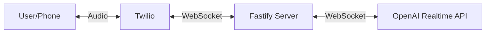
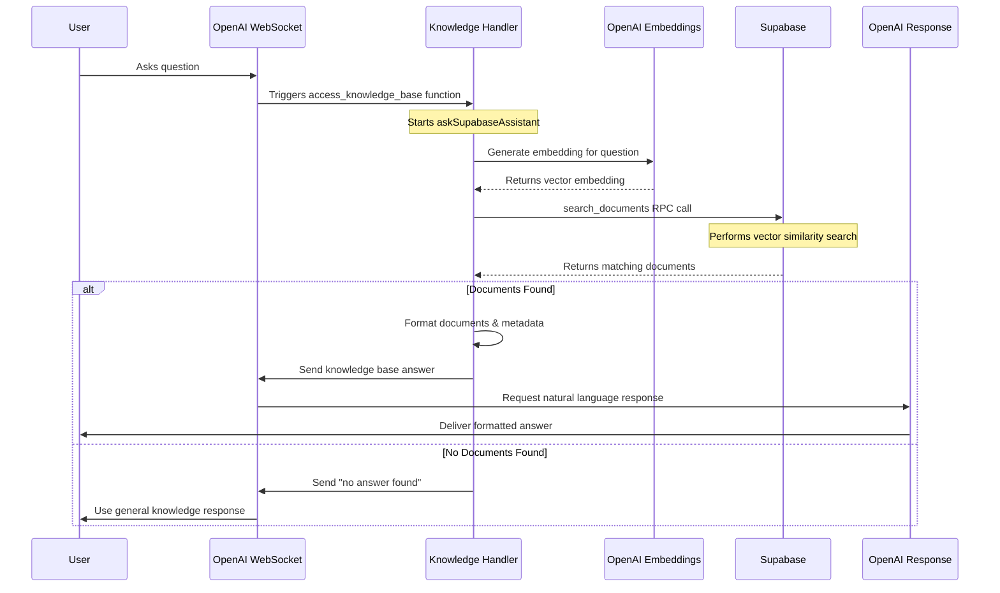
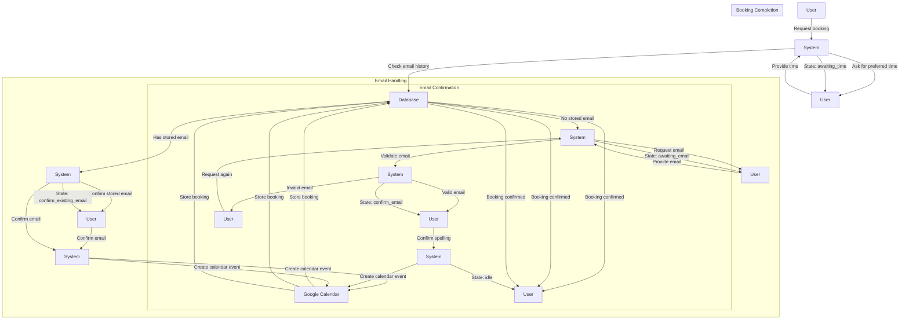
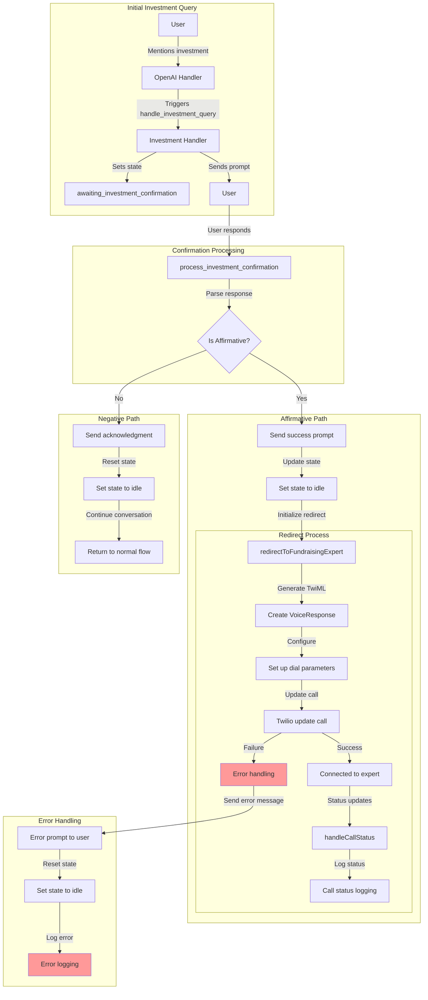
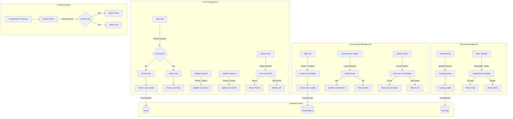
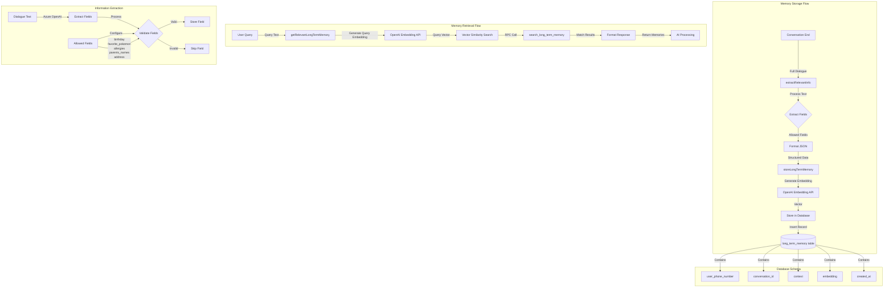

# AI Assistant System Documentation

A sophisticated AI assistant system featuring booking management, investment handling, long-term memory, and intelligent conversation capabilities.

## Table of Contents

- [Overview](#overview)
- [System Architecture](#system-architecture)
  - [Basic Flow](#basic-flow)
  - [Knowledge Base Flow](#knowledge-base-flow)
  - [Booking Flow](#booking-flow)
  - [Investment Flow](#investment-flow)
  - [Data Collection Logic](#data-collection-logic)
  - [Long-Term Memory Flow](#long-term-memory-flow)
- [Core Components](#core-components)
  - [Booking System](#booking-system)
  - [Investment Handling](#investment-handling)
  - [Long-Term Memory System](#long-term-memory-system)
- [Database Setup](#database-setup)
- [Setup and Installation](#setup-and-installation)
  - [Prerequisites](#prerequisites)
  - [Installation Steps](#installation-steps)
- [Environment Variables](#environment-variables)
- [API Documentation](#api-documentation)
  - [Conversation Endpoints](#conversation-endpoints)
  - [Booking Endpoints](#booking-endpoints)
  - [Investment Endpoints](#investment-endpoints)
- [Development](#development)
  - [Local Development](#local-development)
  - [Database Migrations](#database-migrations)
- [Monitoring and Logging](#monitoring-and-logging)
  - [Log Levels](#log-levels)
- [Security Considerations](#security-considerations)
- [Contributing](#contributing)
- [License](#license)
- [Support](#support)
- [Acknowledgments](#acknowledgments)
- [SQL Scripts](#sql-scripts)

## Overview

The AI Assistant System is a comprehensive solution that provides:

- Automated booking management with Google Calendar integration
- Investment inquiry handling with expert redirection
- Long-term memory for personalized user interactions
- Robust database operations for data persistence

## System Architecture

The system architecture consists of several interconnected components that work together to deliver intelligent and seamless user interactions. Below are detailed diagrams and explanations of each major flow within the system.

### Basic Flow



**Explanation:**

1. **User/Phone:** The interaction begins with the user initiating a call or sending an audio message through their phone.
2. **Twilio:** Twilio handles the call management and audio streaming, acting as a bridge between the user's phone and the server.
3. **Fastify Server:** The Fastify server receives the audio data via WebSocket from Twilio. It manages incoming connections and routes the audio data appropriately.
4. **OpenAI Realtime API:** The Fastify server forwards the audio data to the OpenAI Realtime API for processing, enabling real-time AI-driven responses.

This basic flow ensures that audio interactions from users are efficiently captured, processed, and responded to using AI capabilities.

### Reference Video

For a comprehensive walkthrough of the basic setup and connection process, refer to this [Twilio YouTube video](https://youtu.be/csoe8Gc4_RQ?si=FA2Q8BC7yeEjeegj). This video provides a step-by-step guide to getting the entire system up and running.

### Knowledge Base Flow



**Explanation:**

1. **User Interaction:** The user poses a question through the interface.
2. **OpenAI WebSocket:** The question is sent to the OpenAI WebSocket, which handles real-time communication.
3. **Knowledge Handler:** Upon receiving the question, the Knowledge Handler initiates the `access_knowledge_base` function to retrieve relevant information.
4. **OpenAI Embeddings:** The Knowledge Handler requests an embedding (vector representation) of the question from OpenAI Embeddings to facilitate semantic search.
5. **Supabase:** Using the generated embedding, the Knowledge Handler performs a vector similarity search in Supabase to find matching documents.
6. **Response Handling:**
   - **Documents Found:** If relevant documents are found, they are formatted with metadata and sent back through the OpenAI WebSocket. The OpenAI Response module generates a natural language answer based on this information, which is then delivered to the user.
   - **No Documents Found:** If no relevant documents are found, a default "no answer found" message is sent, and the system resorts to general knowledge to respond to the user.

This flow ensures that user queries are intelligently matched with existing knowledge bases, providing accurate and contextually relevant answers.

### Booking Flow



**Explanation:**

1. **Booking Request:**
   - **User to System:** The user initiates a booking request.
   - **System to User:** The system asks for the user's preferred time for the booking.
   - **User Response:** The user provides the desired time.
   - **System Action:** The system checks the user's email history in the database.

2. **Email Handling:**
   - **Existing Email:**
     - **System to User:** If a stored email exists, the system confirms this email with the user.
     - **User Confirmation:** The user confirms the email.
     - **System Action:** The system creates a calendar event in Google Calendar and stores the booking in the database.
     - **Booking Confirmation:** The user receives a confirmation of the booking.
   
   - **No Stored Email:**
     - **System to User:** If no email is found, the system requests the user's email.
     - **User Provides Email:** The user provides their email address.
     - **System Validation:** The system validates the provided email.
     - **Email Confirmation:**
       - **Valid Email:** The user confirms the spelling of the valid email. The system then creates the calendar event and stores the booking.
       - **Invalid Email:** The system requests the user to provide the email again.

3. **State Management:**
   - Throughout the booking process, the system maintains various states (e.g., `awaiting_time`, `awaiting_email`, `confirm_email`, `idle`) to manage the flow and ensure correct sequencing of interactions.

This flow ensures a seamless and secure booking process, validating user information and integrating with external calendar services for effective scheduling.

### Investment Flow



**Explanation:**

1. **Initial Investment Query:**
   - **User Interaction:** The user mentions an investment-related query.
   - **OpenAI Handler:** Detects the investment mention and triggers the `handle_investment_query` function.
   - **Investment Handler:** Sets the system state to `awaiting_investment_confirmation` and sends a prompt to the user seeking confirmation.

2. **Confirmation Processing:**
   - **User Response:** The user responds to the investment query prompt.
   - **Process Investment Confirmation:** The system processes the user's response to determine if it's affirmative.

3. **Affirmative Path:**
   - **Positive Confirmation:**
     - **Send Success Prompt:** The system acknowledges the positive response.
     - **Update State:** The system resets the state to `idle`.
     - **Initialize Redirect:** The system initiates the redirection process to connect the user with a fundraising expert.
   
   - **Redirect Process:**
     - **Generate TwiML:** Creates a Twilio Markup Language response to manage call flow.
     - **Configure Dial Parameters:** Sets up dialing parameters for the expert.
     - **Update Call:** Updates the call parameters in Twilio to connect to the expert.
     - **Connection Outcomes:**
       - **Success:** The user is connected to the fundraising expert, and the call status is logged.
       - **Failure:** Error handling procedures are activated.

4. **Negative Path:**
   - **Non-Affirmative Confirmation:**
     - **Send Acknowledgment:** The system acknowledges the user's decision not to proceed.
     - **Reset State:** The system resets the state to `idle`.
     - **Continue Conversation:** The conversation continues as normal without redirection.

5. **Error Handling:**
   - **Redirect Failure:**
     - **Send Error Message:** Informs the user of the issue connecting to the expert.
     - **Reset State:** Resets the state to `idle`.
     - **Log Error:** Logs the error for further investigation.

This investment flow ensures that user investment inquiries are handled with care, providing options for expert assistance while managing states and potential errors gracefully.

### Data Collection Logic



**Explanation:**

1. **User Management:**
   - **New Call:**
     - **Phone Number Capture:** When a new call is received, the system captures the user's phone number.
     - **User Verification:** Checks if the user already exists in the database.
     - **User Creation:** If the user does not exist, a new user is created and stored in the `users` table.
     - **User Data Retrieval:** If the user exists, their data is fetched for use in the conversation.
   
   - **Update Requests:**
     - **Name Update:** Allows updating the user's name based on phone number.
     - **Email Update:** Allows updating the user's email based on phone number.
   
   - **Email Query:**
     - **Retrieve Email:** Queries the user's email based on their phone number.
     - **Response Handling:** Returns the email if found; otherwise, returns null.

2. **Conversation Management:**
   - **Start Call:**
     - **Conversation Initialization:** Creates a new conversation record in the `conversations` table using the user's phone number and CallSID.
   
   - **Conversation Update:**
     - **Existence Check:** Verifies if the conversation exists before updating.
     - **Update Operation:** Updates conversation details if it exists. Handles errors if it does not.
   
   - **History Query:**
     - **Retrieve Last Conversation:** Fetches the last conversation for context in ongoing interactions.
     - **Response Handling:** Returns the conversation if found; otherwise, returns null.

3. **Booking Management:**
   - **New Booking:**
     - **Booking Creation:** Creates a new booking record with multiple parameters such as phone number, conversation ID, event ID, time, and email.
     - **Database Storage:** Stores the booking in the `bookings` table.
   
   - **State Change:**
     - **Update Booking State:** Updates the state of a booking (e.g., confirmed, pending) based on the BookingID.
     - **Operation Outcome:** Returns true on success and false on failure.

4. **Email Extraction:**
   - **Conversation Summary:**
     - **Email Extraction:** Uses Azure OpenAI services to extract email addresses from conversation summaries.
     - **Validation:** Determines if the extracted email is valid.
     - **Response Handling:** Returns the email if valid; otherwise, returns null.

5. **Database Tables:**
   - **Users Table:** Stores user information including phone number, name, and email.
   - **Conversations Table:** Stores conversation details associated with users.
   - **Bookings Table:** Stores booking information linked to conversations and users.

This comprehensive data collection logic ensures efficient user management, conversation tracking, booking handling, and secure email extraction, maintaining the integrity and reliability of the system.

### Long-Term Memory Flow



**Explanation:**

1. **Memory Storage Flow:**
   - **Conversation End:** When a conversation concludes, the full dialogue is captured.
   - **Extract Relevant Information:** The system processes the dialogue text to extract pertinent information.
   - **Field Extraction:**
     - **Allowed Fields:** Only specific fields (`birthday`, `favorite_pokemon`, `allergies`, `parents_names`, `address`) are extracted to ensure relevance and privacy.
     - **Validation:** Extracted fields are validated for correctness.
     - **JSON Formatting:** Valid fields are formatted into a structured JSON object.
   - **Store Long-Term Memory:**
     - **Embedding Generation:** The structured data is sent to the OpenAI Embedding API to generate a vector embedding.
     - **Database Storage:** The generated embedding and associated context are stored in the `long_term_memory` table within the database.

2. **Memory Retrieval Flow:**
   - **User Query:** When a user poses a query, the system retrieves relevant long-term memories.
   - **Embedding Generation:** The query text is converted into an embedding using the OpenAI Embedding API.
   - **Vector Similarity Search:** A similarity search is performed against the stored embeddings in the database using an RPC call (`search_long_term_memory`).
   - **Format Response:** Matching results are formatted and returned to the AI for processing.
   - **AI Processing:** The AI utilizes the retrieved memories to generate a contextually enriched response to the user.

3. **Information Extraction:**
   - **Dialogue Text Processing:** Utilizes Azure OpenAI services to parse and extract specific fields from the dialogue.
   - **Field Validation:**
     - **Valid Fields:** Properly formatted and relevant fields are stored for long-term memory.
     - **Invalid Fields:** Fields that do not meet validation criteria are skipped to maintain data integrity.
   - **Allowed Fields Configuration:** Ensures that only predefined fields are processed and stored.

4. **Database Schema:**
   - **Long-Term Memory Table:**
     - **user_phone_number:** Links memories to specific users.
     - **conversation_id:** Associates memories with specific conversations.
     - **context:** Stores the contextual information extracted.
     - **embedding:** Holds the vector representation for similarity searches.
     - **created_at:** Timestamp of when the memory was stored.

This long-term memory flow enables the system to maintain personalized interactions by recalling relevant information from past conversations, enhancing user experience and ensuring continuity.

## Core Components

### Booking System

The booking system manages training session scheduling through Google Calendar integration.

#### Implementation Details

```javascript:src/services/google/booking.js
export async function askForSuitableTime(openAiWs) {
    const prompt = "Sure! I'd be happy to book a training session for you. What time would suit you best?";
    openAiWs.send(JSON.stringify({
        type: "response.create",
        response: {
            modalities: ["text", "audio"],
            instructions: prompt,
            voice: VOICE,
            temperature: 0.7,
            max_output_tokens: 150,
        },
    }));
    openAiWs.bookingState = 'awaiting_time';
    await updateBookingStateWithRetry(openAiWs.phoneNumber, 'awaiting_time');
}
```

**Explanation:**

This function initiates the booking process by prompting the user to provide their preferred time for a training session. It sends a response through the WebSocket, updates the booking state to `awaiting_time`, and ensures that the state is persisted in the database with retry logic to handle potential failures.

### Investment Handling

The investment handling system manages investor inquiries and expert redirection.

#### Implementation Details

```javascript:src/services/google/investment.js
export async function redirectToFundraisingExpert(callSid) {
    if (!callSid) {
        throw new Error('Call SID is required for redirection');
    }

    try {
        const twiml = new VoiceResponse();
        twiml.say({
            voice: 'alice'
        }, "Connecting you to our fundraising expert now.");
        
        twiml.dial({
            action: '/call-status',
            method: 'POST',
            timeout: 30,
            statusCallbackEvent: ['initiated', 'ringing', 'answered', 'completed'],
            statusCallback: '/call-status',
            statusCallbackMethod: 'POST'
        }, process.env.EXPERT_PHONE_NUMBER);

        await twilioClient.calls(callSid).update({
            twiml: twiml.toString()
        });
    } catch (error) {
        console.error("Failed to redirect to fundraising expert:", error);
        throw error;
    }
}
```

**Explanation:**

This function handles the redirection of a call to a fundraising expert using Twilio's Voice API. It constructs a TwiML response that instructs Twilio to dial the expert's phone number. The function also sets up callbacks to monitor the status of the call and handles any potential errors during the redirection process.

### Long-Term Memory System

The long-term memory system provides persistent storage and retrieval of user information using vector embeddings.

#### Implementation Details

```javascript:src/database/long-term-memory.js
import { generateEmbedding } from '../utils/utils.js';
import { supabase } from '../config/supabase-client.js';
import fetch from 'node-fetch';
import dotenv from "dotenv";
import path from 'path';
import { fileURLToPath } from 'url';

// Set up environment
const __filename = fileURLToPath(import.meta.url);
const __dirname = path.dirname(__filename);
dotenv.config({ path: path.resolve(__dirname, '../../.env') });

/**
 * Retrieves relevant memories based on query and phone number
 */
export async function getRelevantLongTermMemory(phoneNumber, query) {
    try {
        // Generate embedding for the query
        const embeddingResponse = await fetch("https://api.openai.com/v1/embeddings", {
            method: "POST",
            headers: {
                "Content-Type": "application/json",
                "Authorization": `Bearer ${process.env.OPENAI_API_KEY}`,
            },
            body: JSON.stringify({
                input: query,
                model: "text-embedding-ada-002",
            }),
        });

        if (!embeddingResponse.ok) {
            console.error("Error fetching embedding from OpenAI:", embeddingResponse.statusText);
            return [];
        }

        const embeddingData = await embeddingResponse.json();
        const queryEmbedding = embeddingData.data[0].embedding;

        // Search memories using embedding similarity
        const { data, error } = await supabase.rpc(
            'search_long_term_memory',
            {
                query_embedding: queryEmbedding,
                user_phone: phoneNumber,
                match_threshold: 0.5,
                match_count: 3
            }
        );

        if (error) {
            console.error('Error retrieving long-term memory:', error);
            return [];
        }

        return data.map(item => item.context);
    } catch (error) {
        console.error('Error in getRelevantLongTermMemory:', error);
        return [];
    }
}

/**
 * Extracts relevant information from the conversation summary
 */
export async function extractRelevantInfo(dialogue) {
    const allowedFields = ['birthday', 'favorite_pokemon', 'allergies', 'parents_names', 'address'];
    
    try {
        const response = await fetch(process.env.AZURE_OPENAI_CHAT_ENDPOINT, {
            method: "POST",
            headers: {
                "Content-Type": "application/json",
                "api-key": process.env.AZURE_OPENAI_CHAT_API_KEY,
            },
            body: JSON.stringify({
                messages: [
                    { 
                        role: "system", 
                        content: "Extract key information mentioned in the conversation. Only include the following fields if explicitly mentioned: birthday, favorite_pokemon, allergies, parents_names, address. Respond with a clean JSON object. Format values as plain strings without special formatting." 
                    },
                    { 
                        role: "user", 
                        content: dialogue 
                    }
                ],
                temperature: 0.3,
                max_tokens: 300,
            }),
        });

        if (!response.ok) {
            throw new Error(`HTTP error! status: ${response.status}`);
        }

        const data = await response.json();
        const content = data.choices[0].message.content;

        const cleanedContent = content
            .replace(/```json\s*/, '')
            .replace(/```\s*$/, '')
            .trim();

        const parsed = JSON.parse(cleanedContent);
        const result = {};

        for (const field of allowedFields) {
            if (parsed[field] && typeof parsed[field] === 'string' && parsed[field].trim()) {
                result[field] = parsed[field].trim();
            }
        }

        console.log("Extracted information:", result);
        return result;

    } catch (error) {
        console.error("Error in extractRelevantInfo:", error);
        return {};
    }
}
```

**Explanation:**

1. **Retrieving Relevant Memories:**
   - **Embedding Generation:** The user's query is transformed into a vector embedding using OpenAI's Embedding API.
   - **Vector Similarity Search:** The embedding is used to perform a similarity search in Supabase, retrieving the top three matching documents that meet the similarity threshold.
   - **Result Handling:** If matching documents are found, their contexts are returned for further processing; otherwise, an empty array is returned.

2. **Extracting Relevant Information:**
   - **Azure OpenAI Chat:** Processes the full dialogue to extract specific fields (`birthday`, `favorite_pokemon`, `allergies`, `parents_names`, `address`).
   - **JSON Formatting:** The extracted information is cleaned and parsed into a JSON object.
   - **Validation:** Only valid and non-empty fields are retained and returned for storage in long-term memory.

This system ensures that personalized information is effectively captured and stored, enabling the AI to provide contextually aware and personalized responses in future interactions.

## Database Setup

All SQL scripts required for Supabase setup are provided in the `src/database/SQL` directory. These scripts include:

- **[table-setup.sql](src/database/SQL/table-setup.sql):** Creates necessary tables such as `users`, `long_term_memory`, `bookings`, `conversations`, and `documents`.
  
  ```sql
  -- Create the users table
  CREATE TABLE users (
      phone_number TEXT PRIMARY KEY,
      name TEXT,
      email TEXT,
      created_at TIMESTAMPTZ
  );

  -- Create the long_term_memory table
  CREATE TABLE long_term_memory (
      id SERIAL PRIMARY KEY,
      user_phone_number TEXT REFERENCES users(phone_number),
      conversation_id TEXT REFERENCES conversations(conversation_id),
      context TEXT,
      embedding VECTOR,
      created_at TIMESTAMPTZ
  );

  -- Create the bookings table
  CREATE TABLE bookings (
      booking_id TEXT PRIMARY KEY,
      phone_number TEXT REFERENCES users(phone_number),
      conversation_id TEXT REFERENCES conversations(conversation_id),
      booking_state TEXT,
      booking_time TIMESTAMPTZ,
      booking_email TEXT,
      created_at TIMESTAMPTZ
  );

  -- Create the conversations table
  CREATE TABLE conversations (
      conversation_id TEXT PRIMARY KEY,
      phone_number TEXT REFERENCES users(phone_number),
      full_dialogue TEXT,
      summary TEXT,
      start_timestamp TIMESTAMPTZ,
      end_timestamp TIMESTAMPTZ,
      last_question TEXT,
      last_answer TEXT
  );

  -- Create the documents table
  CREATE TABLE documents (
      id SERIAL PRIMARY KEY,
      context TEXT,
      embedding VECTOR,
      metadata JSONB
  );
  ```

- **[search-long-term-memory.sql](src/database/SQL/search-long-term-memory.sql):** Function to retrieve similar embeddings from `long_term_memory`.

  ```sql
  -- Enable the pgvector extension if not already enabled
  CREATE EXTENSION IF NOT EXISTS vector;

  -- Create the function to retrieve similar embeddings from long_term_memory
  CREATE OR REPLACE FUNCTION get_user_similar_memory(
      user_phone TEXT,
      query_embedding VECTOR,
      match_threshold FLOAT,
      match_count INT
  )
  RETURNS TABLE (
      context TEXT,
      similarity FLOAT
  ) AS $$
  BEGIN
      RETURN QUERY
      SELECT 
          ltm.context,
          1 - (ltm.embedding <=> query_embedding) AS similarity
      FROM long_term_memory ltm
      WHERE ltm.user_phone_number = user_phone
        AND 1 - (ltm.embedding <=> query_embedding) > match_threshold
      ORDER BY ltm.embedding <=> query_embedding
      LIMIT match_count;
  END;
  $$ LANGUAGE plpgsql;
  ```

- **[search-documents.sql](src/database/SQL/search-documents.sql):** Function to retrieve the top 5 most similar documents.

  ```sql
  -- Enable the pgvector extension if not already enabled
  CREATE EXTENSION IF NOT EXISTS vector;

  -- Create the function to retrieve the top 5 most similar documents
  CREATE OR REPLACE FUNCTION get_similar_documents(query_embedding VECTOR)
  RETURNS TABLE (
      id INT,
      context TEXT,
      metadata JSONB,
      similarity FLOAT
  ) AS $$
  BEGIN
      RETURN QUERY
      SELECT 
          documents.id, 
          documents.context, 
          documents.metadata,
          1 - (documents.embedding <=> query_embedding) AS similarity
      FROM documents
      WHERE 1 - (documents.embedding <=> query_embedding) > 0.7
      ORDER BY similarity DESC
      LIMIT 5;
  END;
  $$ LANGUAGE plpgsql;
  ```

Ensure that you have the `pgvector` extension installed in your PostgreSQL database to enable vector operations.

## Setup and Installation

### Prerequisites

- **Node.js** (v16 or higher)
- **PostgreSQL** with `pgvector` extension
- **Supabase** account
- **OpenAI** API access
- **Azure OpenAI** API access
- **Twilio** account
- **Google Calendar** API credentials
- **ngrok** installed for tunneling (optional but recommended for local development)

### Installation Steps

1. **Clone the repository**

    ```bash
    git clone <repository-url>
    cd ai-assistant-system
    ```

2. **Install dependencies**

    ```bash
    npm install
    ```

3. **Set up environment variables**

    ```bash
    cp .env.example .env
    ```

4. **Initialize the database**

    ```bash
    npm run db:init
    ```

5. **Run the application**

    The application is configured to run on port `5050`. Start the server using:

    ```bash
    node index.js
    ```

6. **Set up ngrok**

    To expose your local server to the internet, especially for Twilio webhooks, set up ngrok:

    ```bash
    ngrok http 5050
    ```

    This command will provide a public URL that forwards to your local server on port `5050`. Update your Twilio webhook URLs with the provided ngrok URL to ensure proper communication between Twilio and your application.

## Environment Variables

Create a `.env` file with the following variables:

```env
# OpenAI Configuration
OPENAI_API_KEY=your_openai_api_key
AZURE_OPENAI_CHAT_API_KEY=your_azure_api_key
AZURE_OPENAI_CHAT_ENDPOINT=your_azure_endpoint

# Database Configuration
SUPABASE_URL=your_supabase_url
SUPABASE_KEY=your_supabase_key

# Twilio Configuration
TWILIO_ACCOUNT_SID=your_twilio_sid
TWILIO_AUTH_TOKEN=your_twilio_token
TWILIO_PHONE_NUMBER=your_twilio_number

# Google Calendar Configuration
GOOGLE_CALENDAR_ID=your_calendar_id
GOOGLE_CLIENT_EMAIL=your_client_email
GOOGLE_PRIVATE_KEY=your_private_key

# Application Configuration
EXPERT_PHONE_NUMBER=your_expert_number
VOICE=your_preferred_voice
```

## API Documentation

### Conversation Endpoints

#### Start Conversation

```http
POST /api/conversation/start
Content-Type: application/json

{
    "phone_number": "string",
    "initial_message": "string"
}
```

#### End Conversation

```http
POST /api/conversation/end
Content-Type: application/json

{
    "conversation_id": "string"
}
```

### Booking Endpoints

#### Create Booking

```http
POST /api/booking/create
Content-Type: application/json

{
    "phone_number": "string",
    "preferred_time": "string",
    "email": "string"
}
```

### Investment Endpoints

#### Handle Investment Query

```http
POST /api/investment/handle
Content-Type: application/json

{
    "conversation_id": "string",
    "call_sid": "string"
}
```

## Development

### Local Development

1. **Start the development server**

    ```bash
    npm run dev
    ```

2. **Run tests**

    ```bash
    npm test
    ```

3. **Lint code**

    ```bash
    npm run lint
    ```

### Database Migrations

1. **Create a new migration**

    ```bash
    npm run migration:create
    ```

2. **Run migrations**

    ```bash
    npm run migration:up
    ```

## Monitoring and Logging

The system implements comprehensive logging:

- **Application Logs:** Managed via Winston for structured logging.
- **Error Tracking:** Integrated with Sentry for real-time error monitoring.
- **Performance Monitoring:** Utilizes New Relic to monitor application performance.

### Log Levels

```javascript
{
  error: 0,
  warn: 1,
  info: 2,
  debug: 3
}
```

## Security Considerations

- **Authenticated Endpoints:** All API endpoints require proper authentication.
- **Rate Limiting:** Implemented to prevent abuse and ensure fair usage.
- **Input Validation:** Ensures all inputs are sanitized and validated.
- **Secure Storage:** Sensitive information is stored securely with encryption.
- **Regular Audits:** Conducted to identify and mitigate security risks.

## Contributing

1. **Fork the repository**
2. **Create a feature branch**
3. **Commit changes**
4. **Push to the branch**
5. **Create a Pull Request**

**Guidelines:**

- Follow the coding standards
- Write clear commit messages
- Ensure all tests pass
- Provide documentation for new features


## SQL Scripts

All SQL scripts required for Supabase setup are provided in the `src/database/SQL` directory. These scripts include:

- **[table-setup.sql](src/database/SQL/table-setup.sql)**
- **[search-long-term-memory.sql](src/database/SQL/search-long-term-memory.sql)**
- **[search-documents.sql](src/database/SQL/search-documents.sql)**

These scripts create the necessary database schema and functions needed for the system to operate effectively.

```sql:src/database/SQL/table-setup.sql
-- Create the users table
CREATE TABLE users (
    phone_number TEXT PRIMARY KEY,
    name TEXT,
    email TEXT,
    created_at TIMESTAMPTZ
);

-- Create the long_term_memory table
CREATE TABLE long_term_memory (
    id SERIAL PRIMARY KEY,
    user_phone_number TEXT REFERENCES users(phone_number),
    conversation_id TEXT REFERENCES conversations(conversation_id),
    context TEXT,
    embedding VECTOR,
    created_at TIMESTAMPTZ
);

-- Create the bookings table
CREATE TABLE bookings (
    booking_id TEXT PRIMARY KEY,
    phone_number TEXT REFERENCES users(phone_number),
    conversation_id TEXT REFERENCES conversations(conversation_id),
    booking_state TEXT,
    booking_time TIMESTAMPTZ,
    booking_email TEXT,
    created_at TIMESTAMPTZ
);

-- Create the conversations table
CREATE TABLE conversations (
    conversation_id TEXT PRIMARY KEY,
    phone_number TEXT REFERENCES users(phone_number),
    full_dialogue TEXT,
    summary TEXT,
    start_timestamp TIMESTAMPTZ,
    end_timestamp TIMESTAMPTZ,
    last_question TEXT,
    last_answer TEXT
);

-- Create the documents table
CREATE TABLE documents (
    id SERIAL PRIMARY KEY,
    context TEXT,
    embedding VECTOR,
    metadata JSONB
);
```

```sql:src/database/SQL/search-long-term-memory.sql
-- Enable the pgvector extension if not already enabled
CREATE EXTENSION IF NOT EXISTS vector;

-- Create the function to retrieve similar embeddings from long_term_memory
CREATE OR REPLACE FUNCTION get_user_similar_memory(
    user_phone TEXT,
    query_embedding VECTOR,
    match_threshold FLOAT,
    match_count INT
)
RETURNS TABLE (
    context TEXT,
    similarity FLOAT
) AS $$
BEGIN
    RETURN QUERY
    SELECT 
        ltm.context,
        1 - (ltm.embedding <=> query_embedding) AS similarity
    FROM long_term_memory ltm
    WHERE ltm.user_phone_number = user_phone
      AND 1 - (ltm.embedding <=> query_embedding) > match_threshold
    ORDER BY ltm.embedding <=> query_embedding
    LIMIT match_count;
END;
$$ LANGUAGE plpgsql;
```

```sql:src/database/SQL/search-documents.sql
-- Enable the pgvector extension if not already enabled
CREATE EXTENSION IF NOT EXISTS vector;

-- Create the function to retrieve the top 5 most similar documents
CREATE OR REPLACE FUNCTION get_similar_documents(query_embedding VECTOR)
RETURNS TABLE (
    id INT,
    context TEXT,
    metadata JSONB,
    similarity FLOAT
) AS $$
BEGIN
    RETURN QUERY
    SELECT 
        documents.id, 
        documents.context, 
        documents.metadata,
        1 - (documents.embedding <=> query_embedding) AS similarity
    FROM documents
    WHERE 1 - (documents.embedding <=> query_embedding) > 0.7
    ORDER BY similarity DESC
    LIMIT 5;
END;
$$ LANGUAGE plpgsql;
```

These scripts should be executed in your Supabase PostgreSQL database to set up the necessary tables and functions for the AI Assistant System.