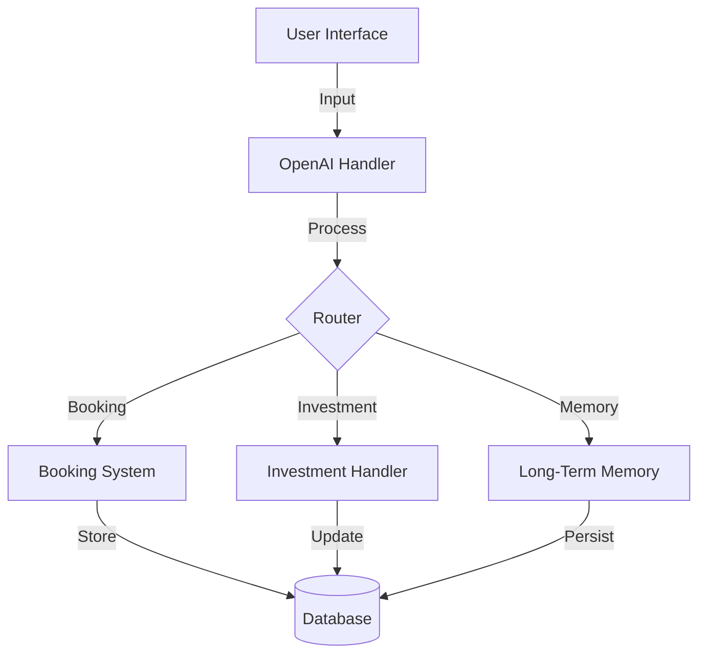
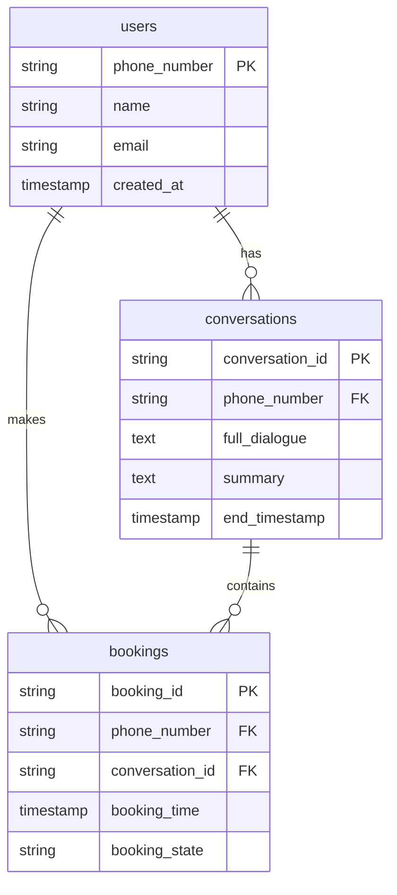
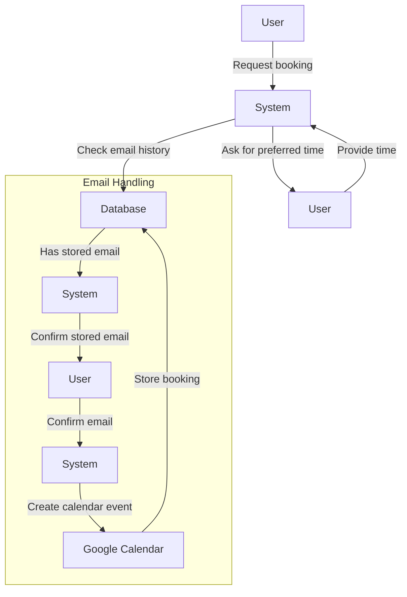
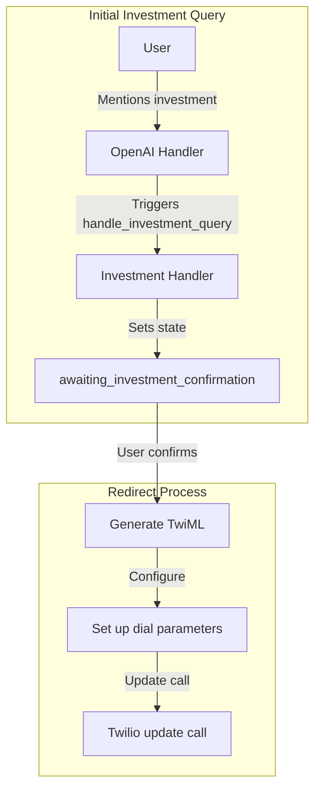
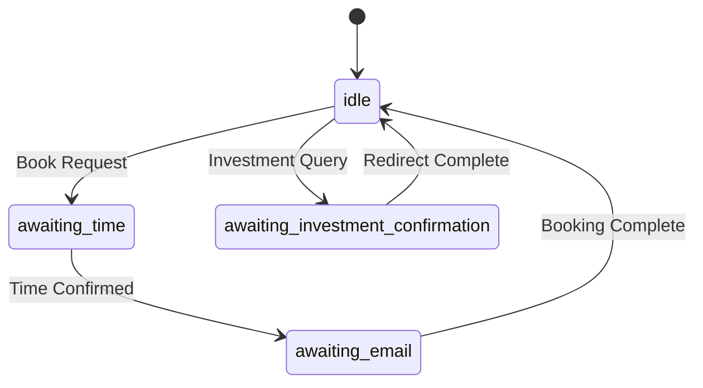
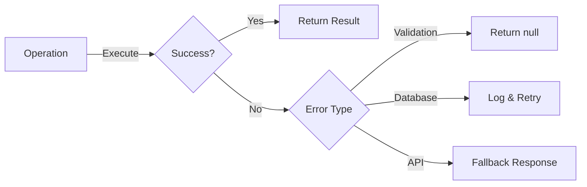

# AI Assistant System Documentation

A sophisticated AI assistant system featuring booking management, investment handling, long-term memory, and intelligent conversation capabilities.

## Table of Contents
- [Overview](#overview)
- [Features](#features)
- [System Architecture](#system-architecture)
- [Core Components](#core-components)
  - [Booking System](#booking-system)
  - [Investment Handling](#investment-handling)
  - [Long-Term Memory System](#long-term-memory-system)
  - [Database Operations](#database-operations)
- [Setup and Installation](#setup-and-installation)
- [Environment Variables](#environment-variables)
- [API Documentation](#api-documentation)
- [Development](#development)
- [Deployment](#deployment)
- [Monitoring and Logging](#monitoring-and-logging)
- [Security Considerations](#security-considerations)
- [Contributing](#contributing)
- [License](#license)
- [Support](#support)
- [Acknowledgments](#acknowledgments)

## Overview

The AI Assistant System is a comprehensive solution that provides:
- Automated booking management with Google Calendar integration
- Investment inquiry handling with expert redirection
- Long-term memory for personalized user interactions
- Robust database operations for data persistence

## Features

- **Intelligent Conversation**
  - Natural language processing
  - Context-aware responses
  - Multi-modal interaction (text/voice)

- **Booking Management**
  - Automated scheduling
  - Email confirmation
  - Google Calendar integration
  - State management

- **Investment Handling**
  - Expert redirection
  - Call management
  - State tracking

- **Long-Term Memory**
  - Vector embeddings
  - Semantic search
  - Persistent user information

## System Architecture

### Core Components Interaction



### Database Schema



## Core Components

### Booking System

The booking system manages training session scheduling through Google Calendar integration.



#### Implementation Details

```javascript
export async function askForSuitableTime(openAiWs) {
    const prompt = "Sure! I'd be happy to book a training session for you. What time would suit you best?";
    openAiWs.send(JSON.stringify({
        type: "response.create",
        response: {
            modalities: ["text", "audio"],
            instructions: prompt,
            voice: VOICE,
            temperature: 0.7,
            max_output_tokens: 150,
        },
    }));
    openAiWs.bookingState = 'awaiting_time';
    await updateBookingStateWithRetry(openAiWs.phoneNumber, 'awaiting_time');
}
```

### Investment Handling

The investment handling system manages investor inquiries and expert redirection.



#### Implementation Details

```javascript
export async function redirectToFundraisingExpert(callSid) {
    if (!callSid) {
        throw new Error('Call SID is required for redirection');
    }

    try {
        const twiml = new VoiceResponse();
        twiml.say({
            voice: 'alice'
        }, "Connecting you to our fundraising expert now.");
        
        twiml.dial({
            action: '/call-status',
            method: 'POST',
            timeout: 30,
            statusCallbackEvent: ['initiated', 'ringing', 'answered', 'completed'],
            statusCallback: '/call-status',
            statusCallbackMethod: 'POST'
        }, process.env.EXPERT_PHONE_NUMBER);

        await twilioClient.calls(callSid).update({
            twiml: twiml.toString()
        });
    } catch (error) {
        console.error("Failed to redirect to fundraising expert:", error);
        throw error;
    }
}
```

### Long-Term Memory System

The long-term memory system provides persistent storage and retrieval of user information using vector embeddings.

```mermaid
flowchart TD
    subgraph Memory Storage Flow
        A[Conversation End] -->|Full Dialogue| B[extractRelevantInfo]
        B -->|Process Text| C{Extract Fields}
        C -->|Allowed Fields| D[Format JSON]
        D -->|Structured Data| E[storeLongTermMemory]
        
        E -->|Generate Embedding| F[OpenAI Embedding API]
        F -->|Vector| G[Store in Database]
    end

    subgraph Memory Retrieval Flow
        H[User Query] -->|Query Text| I[getRelevantLongTermMemory]
        I -->|Generate Query Embedding| J[OpenAI Embedding API]
        J -->|Query Vector| K[Vector Similarity Search]
        K -->|Match Results| L[Return Memories]
    end
```



#### Implementation Details

```javascript
export async function getRelevantLongTermMemory(phoneNumber, query) {
    try {
        const embeddingResponse = await fetch("https://api.openai.com/v1/embeddings", {
            method: "POST",
            headers: {
                "Authorization": `Bearer ${process.env.OPENAI_API_KEY}`,
            },
            body: JSON.stringify({
                input: query,
                model: "text-embedding-ada-002",
            }),
        });

        const embeddingData = await embeddingResponse.json();
        const queryEmbedding = embeddingData.data[0].embedding;

        const { data } = await supabase.rpc(
            'search_long_term_memory',
            {
                query_embedding: queryEmbedding,
                user_phone: phoneNumber,
                match_threshold: 0.5,
                match_count: 3
            }
        );

        return data.map(item => item.context);
    } catch (error) {
        console.error('Error in getRelevantLongTermMemory:', error);
        return [];
    }
}
```

### State Management

The system implements a robust state management system across all components:



### Error Handling



## Setup and Installation

### Prerequisites
- Node.js (v16 or higher)
- PostgreSQL with Vector extension
- Supabase account
- OpenAI API access
- Azure OpenAI API access
- Twilio account
- Google Calendar API credentials

### Installation Steps

1. Clone the repository
```bash
git clone <repository-url>
cd ai-assistant-system
```

2. Install dependencies
```bash
npm install
```

3. Set up environment variables
```bash
cp .env.example .env
```

4. Initialize the database
```bash
npm run db:init
```

## Environment Variables

Create a `.env` file with the following variables:

```env
# OpenAI Configuration
OPENAI_API_KEY=your_openai_api_key
AZURE_OPENAI_CHAT_API_KEY=your_azure_api_key
AZURE_OPENAI_CHAT_ENDPOINT=your_azure_endpoint

# Database Configuration
SUPABASE_URL=your_supabase_url
SUPABASE_KEY=your_supabase_key

# Twilio Configuration
TWILIO_ACCOUNT_SID=your_twilio_sid
TWILIO_AUTH_TOKEN=your_twilio_token
TWILIO_PHONE_NUMBER=your_twilio_number

# Google Calendar Configuration
GOOGLE_CALENDAR_ID=your_calendar_id
GOOGLE_CLIENT_EMAIL=your_client_email
GOOGLE_PRIVATE_KEY=your_private_key

# Application Configuration
EXPERT_PHONE_NUMBER=your_expert_number
VOICE=your_preferred_voice
```

## API Documentation

### Conversation Endpoints

#### Start Conversation
```http
POST /api/conversation/start
Content-Type: application/json

{
    "phone_number": "string",
    "initial_message": "string"
}
```

#### End Conversation
```http
POST /api/conversation/end
Content-Type: application/json

{
    "conversation_id": "string"
}
```

### Booking Endpoints

#### Create Booking
```http
POST /api/booking/create
Content-Type: application/json

{
    "phone_number": "string",
    "preferred_time": "string",
    "email": "string"
}
```

### Investment Endpoints

#### Handle Investment Query
```http
POST /api/investment/handle
Content-Type: application/json

{
    "conversation_id": "string",
    "call_sid": "string"
}
```

## Development

### Local Development

1. Start the development server
```bash
npm run dev
```

2. Run tests
```bash
npm test
```

3. Lint code
```bash
npm run lint
```

### Database Migrations

1. Create a new migration
```bash
npm run migration:create
```

2. Run migrations
```bash
npm run migration:up
```

## Deployment

### Production Deployment

1. Build the application
```bash
npm run build
```

2. Start the production server
```bash
npm start
```

### Docker Deployment

1. Build the Docker image
```bash
docker build -t ai-assistant .
```

2. Run the container
```bash
docker run -p 3000:3000 ai-assistant
```

## Monitoring and Logging

The system implements comprehensive logging:

- Application logs via Winston
- Error tracking via Sentry
- Performance monitoring via New Relic

### Log Levels
```javascript
{
  error: 0,
  warn: 1,
  info: 2,
  debug: 3
}
```

## Security Considerations

- All API endpoints are authenticated
- Rate limiting is implemented
- Input validation on all endpoints
- Secure storage of sensitive information
- Regular security audits

## Contributing

1. Fork the repository
2. Create a feature branch
3. Commit changes
4. Push to the branch
5. Create a Pull Request

## License

This project is licensed under the MIT License - see the LICENSE.md file for details.

## Support

For support, email support@example.com or join our Slack channel.

## Acknowledgments

- OpenAI for their API
- Twilio for voice capabilities
- Supabase for database solutions
- Azure for additional AI capabilities
